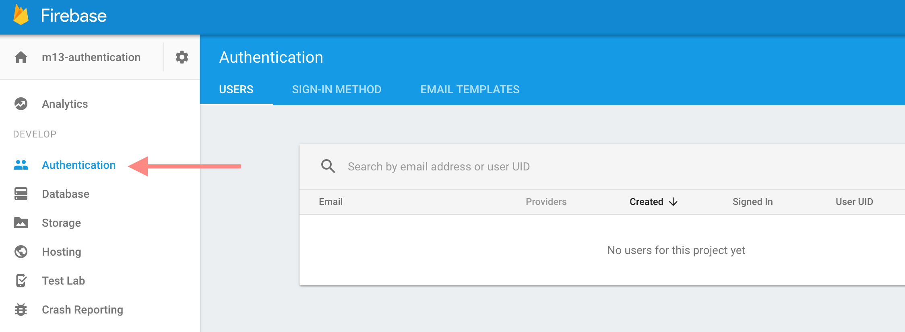
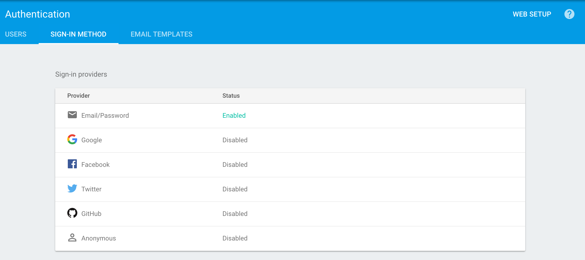

# Module 13: Authentication with Firebase

## Overview
In many web applications you build, you may want to have users create (or login into) an account. Whether it's a social media application or a collaborative research tool, authentication methods can be used to restrict users, show different data to different people, or connect users. In this learning module, you'll learn how to use Firebase's Authentication methods to create and log into accounts for your application.

<!-- START doctoc -->
<!-- END doctoc -->

## Resources
- [Managing Users in Firebase](https://firebase.google.com/docs/auth/web/manage-users)
- [Password Authentication in Firebase](https://firebase.google.com/docs/auth/web/password-auth)
- [Promises and Errors in Firebase](https://firebase.googleblog.com/2016/01/keeping-our-promises-and-callbacks_76.html)
- [JavaScript Promise Docs](https://developer.mozilla.org/en-US/docs/Web/JavaScript/Reference/Global_Objects/Promise)

## Set up
In your firebase console, you'll begin by navigating to the **Authentication** tab using the side-bar menu of your Firebase project:



From that tab, you'll be able to see the users who have accounts for your application. Before using a specified method, you'll need to enable it in the firebase console, which is within the _Sign In Method_ tab of your Authentication dashboard:



Simply click on the method of your choice and use the switch in the dialog box to **Enable** the method of your choice. For this learning module, we'll cover using email + password authentication. Once you have enable this setting on Firebase, you'll be ready to build authentication into your JavaScript files.

## Promises
Before diving into the process for authentication users, it's important to review the concept of **JavaScript Promises**. As described in [Module 11](https://github.com/info343c-a16/m11-reading-data#method-chaining), many JavaScript methods return _Promise objects_, which are tasks which may not have completed yet. Promises provide an alternative structure to the _callback function_, for example:

```javascript
// Request data, and process it in a callback function
$.get('PATH/TO/DATA', function(data){
    // Process data in this callback function
});

// Request data, and process it once it has completed
$.get('PATH/TO/DATA').then(function(data){
    // Process your data in here
});
```
As you can see, the `.then` method _of a promise_ accepts a **function as a parameter**, which will be executed once the promise has finished. To process an error, you can _pass a second function_ to your `.then` method:

```javascript
// Process errors by passing in a second function to the `.then` method
$.get('PATH/TO/DATA').then(
    function(data){
        // Process your data in here
    },
    function(error) {
        // Process your error in here
    }
);
```

Note, Firebase objects (_not_ all Promises) also expose a `.catch` method, which allows you to _catch_ any errors returned by a promise:

```javascript
firebasePromise.then(function(data){
    // Process your data
}).catch(function(error){
    // Alert your error to your user
    alert(error)
});
```

Firebase will return an error if you've made a process that it is unable to process, such as signing up with an email address that already exists. In order to use Firebase's authentication methods, we'll use promises to wait for requests to complete, and then process the data returned by Firebase.

## Creating Users
The first thing we'll learn how to do is create users for web applications. Once you have loaded the Firebase library in your `index.html` file, and initialized Firebase with your configuration, you'll have access to the `firebase.auth()` function, which returns an authorization object that you'll use throughout your application. The object returned by `firebase.auth()` has a useful (though verbosely named) `signInWithEmailAndPassword` method that accepts an email and a password as parameters, and creates a user account on Firebase. We'll want to perform actions _after_ the account is created, so we'll need to leverage Promises:


```javascript
// Get email and password from a form
var email = $('#email').val();
var password = $("#password").val();

// Create a user using the values from your form
firebase.auth().createUserWithEmailAndPassword(email, password).then(function(user){
    // Do something after the user has been created
});
```

### Updating User Information
Once your user has been created, you may want to set two additional properties of your user: their `displayName` and `photoURL` (this is the _only information_ that you can store with your users). The `user` object returned by the `createUserWithEmailAndPassword` promise has an `updateProfile` method that allows you to set the `displayName` and `photoURL` property of your user. Note, because this method is interacting with Firebase, we'll want to wait for it to finish (i.e., it _returns a promise_):

```javascript
// Create a user using the values from your form
firebase.auth().createUserWithEmailAndPassword(email, password).then(function(user){
    // Set username
    user.updateProfile({
        displayName:'Display Name here',
        photoURL:'PHOTO/URL/HERE'
    }).then(function() {
        // Do something after the user's profile has been updated!
    })
});
```

## Logging Users In
If a person has already created an account with your application, they can use their email and password to sign in using the `signInWithEmailAndPassword` method of the object returned by `firebase.auth()`. Again, `signInWithEmailAndPassword` will return a _promise_, which we'll want to wait until it completes to take our next action (such as redirecting the page):

```javascript
// Sign in with an email and password
firebase.auth().signInWithEmailAndPassword(email, password)
    .then(function() {
        // Do something here
    })
    .catch(function(error) {
        // Alert your error to your user
    });
```

## Logging Users Out
By default, users will stay logged into your application (in the selected web browser) for 24 hours. A user may want to log out of your application, particularly if they are on a public machine, or if you're protecting sensitive information. Similarly to the approaches to sign in and sign up, the sign out function will return a promise. You can then take the desired actions after the promise has completed using the `.then` method:

```javascript
// Sign out, then redirect
firebase.auth().signOut().then(function() {
    window.location = 'sign-up.html';
});
```
## Listening to Authentication Changes
While Firebase allows you to get the current user by accessing `firebase.auth().currentUser;`, the documentation warns that _*"currentUser might also be null because the auth object has not finished initializing."*_. So, similarly to other Firebase objects, we can listen to changes to the state of the application:

```javascript
firebase.auth().onAuthStateChanged(function(user) {
  if (user) {
    // User is signed in.
  } else {
    // No user is signed in.
  }
});
```

This is helpful for checking if the user is _already logged in_ and need to be redirected. Unfortunately, this method will fire _as soon as the state changes_, which might conflict with other actions we are trying to take when a user logs into our application. To avoid this, we can apply some simple JavaScript logic to prevent any interference:

```javascript
var checked; // create an undefined object
firebase.auth().onAuthStateChanged(function(user) {
    if(checked !== true){
        if (user) {
          // User is signed in.
        } else {
          // No user is signed in.
        }
        checked = true;        
    }
});
```
